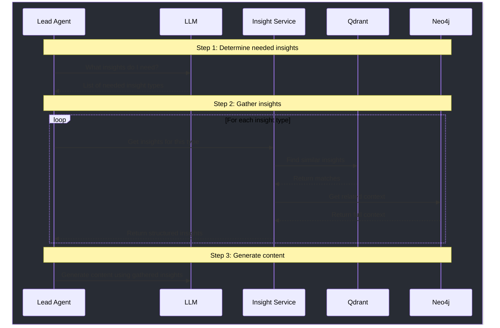
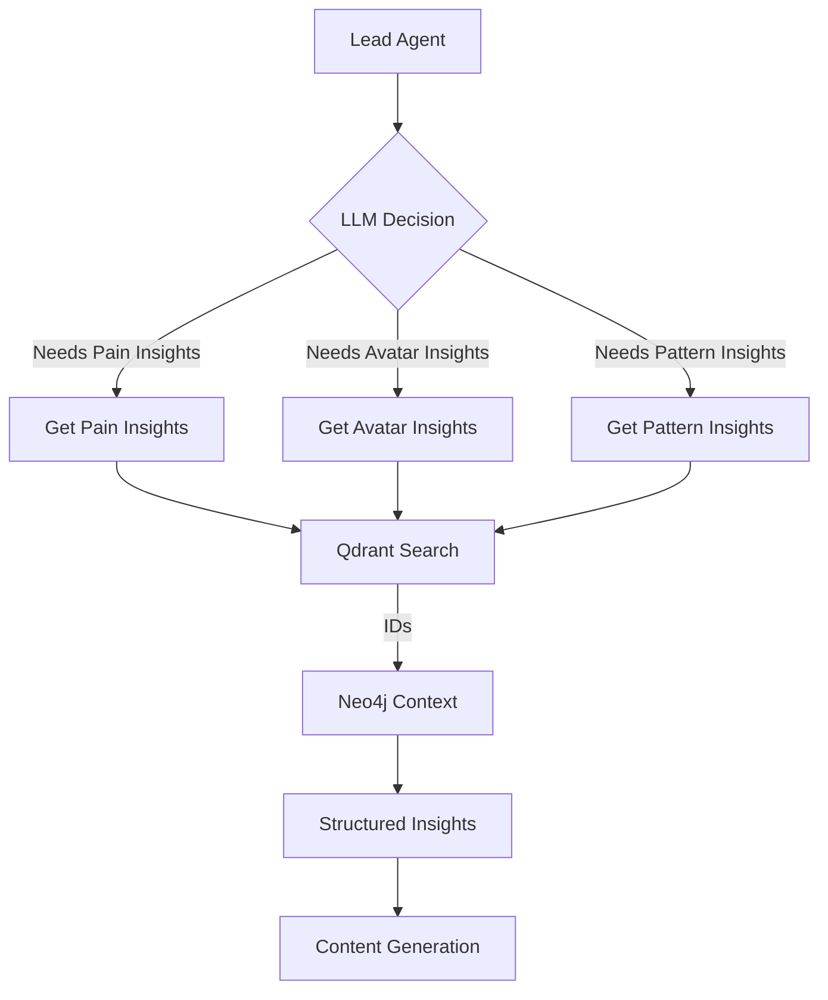
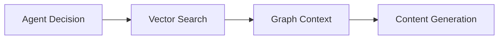

# Agent Insight Retrieval Flow

## Overview
This document outlines how agents autonomously decide what insights they need and retrieve them using a combination of vector similarity (Qdrant) and graph relationships (Neo4j).

## Flow Diagram


## Implementation

### 1. Lead Section Agent
```python
class LeadSectionAgent:
    def __init__(self, insight_service, llm_client):
        self.insight_service = insight_service
        self.llm = llm_client

    async def generate_lead(self, project_id):
        # 1. Agent (LLM) decides what insights it needs
        agent_decision = await self.llm.chat([
            {"role": "system", "content": """
            You are the Lead Section Agent. You have access to these types of insights:
            - Pain Analysis (customer problems and frustrations)
            - Pattern Analysis (recurring themes and behaviors)
            - Avatar Analysis (user personas and characteristics)
            - Product Analysis (product features and benefits)
            
            What insights do you need to write an effective lead section?
            Just list the types you need, no explanation needed.
            """}
        ])
        
        # 2. Get insights through the insight service
        needed_insights = parse_agent_response(agent_decision)
        insights = {}
        
        for insight_type in needed_insights:
            insights[insight_type] = await self.insight_service.get_insights(
                insight_type=insight_type,
                project_id=project_id
            )
```

### 2. Insight Service
```python
class InsightService:
    def __init__(self, qdrant_client, neo4j_client):
        self.qdrant = qdrant_client
        self.neo4j = neo4j_client

    async def get_insights(self, insight_type: str, project_id: str):
        # 1. Get embedding for this type of insight
        embedding = await self.get_type_embedding(insight_type)
        
        # 2. Semantic search in Qdrant
        similar = await self.qdrant.search(
            collection="insights",
            query_vector=embedding,
            filter={
                "must": [
                    {"key": "project_id", "match": {"value": project_id}},
                    {"key": "type", "match": {"value": insight_type}}
                ]
            }
        )
        
        # 3. Get full context from Neo4j using the IDs
        neo4j_ids = [hit.payload.neo4j_id for hit in similar]
        
        # 4. Use Neo4j to get insights with their relationships
        return await self.neo4j.query("""
            MATCH (i:Insight)<-[:GENERATED]-(a:Analysis)
            WHERE i.id IN $ids 
            AND a.project_id = $project_id
            AND a.type = $insight_type
            RETURN i, a
        """, {
            'ids': neo4j_ids,
            'project_id': project_id,
            'insight_type': insight_type
        })
```

## Data Flow Diagram


## Key Components

### 1. Agent Autonomy
- Agents decide what insights they need
- No hardcoded requirements
- Flexible and context-aware decisions

### 2. Insight Retrieval
- Vector similarity for semantic matching
- Graph traversal for relationship context
- Combined approach for rich context

### 3. Data Flow


## Benefits
1. **Dynamic Insight Selection**
   - Agents adapt to different contexts
   - No fixed templates
   - Intelligent decision making

2. **Rich Context Retrieval**
   - Semantic similarity from vectors
   - Relationship context from graph
   - Complete insight picture

3. **Scalable Architecture**
   - Clear separation of concerns
   - Easy to add new insight types
   - Maintainable codebase 