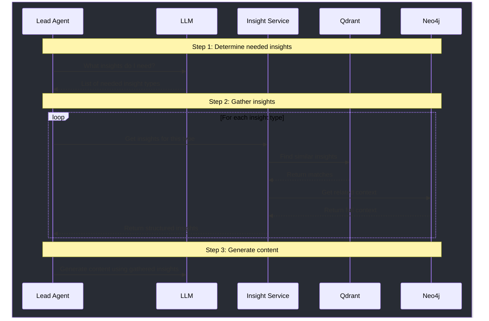

# Agent Insight Retrieval Flow

## Overview

This document outlines how agents autonomously decide what insights they need and retrieve them using a combination of vector similarity (Qdrant) and graph relationships (Neo4j).

## Flow Diagram



## Implementation

### 1. Lead Section Agent

```python
class LeadSectionAgent:
    def __init__(self, insight_service, llm_client):
        self.insight_service = insight_service
        self.llm = llm_client

    async def generate_lead(self, project_id):
        # 1. Agent (LLM) decides what insights it needs
        agent_decision = await self.llm.chat([
            {"role": "system", "content": """
            You are the Lead Section Agent. You have access to these types of insights:
            - Pain Analysis (customer problems and frustrations)
            - Pattern Analysis (recurring themes and behaviors)
            - Avatar Analysis (user personas and characteristics)
            - Product Analysis (product features and benefits)
            
            What insights do you need to write an effective lead section?
            Just list the types you need, no explanation needed.
            """}
        ])
        
        # 2. Get insights through the insight service
        needed_insights = parse_agent_response(agent_decision)
        insights = {}
        
        for insight_type in needed_insights:
            insights[insight_type] = await self.insight_service.get_insights(
                insight_type=insight_type,
                project_id=project_id
            )
```

### 2. Insight Service

```python
class InsightService:
    def __init__(self, qdrant_client, neo4j_client):
        self.qdrant = qdrant_client
        self.neo4j = neo4j_client
``` 